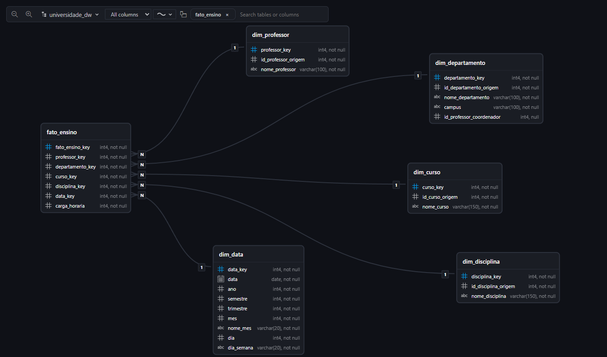

# DIO | Modelo Dimensional - Universidade

Projeto de **Data Warehouse dimensional em Star Schema**, construído a partir do modelo relacional fornecido no desafio.

## Objetivo

Criar um modelo dimensional com foco na **análise das atividades de ensino dos professores**, sem necessidade de representar os alunos.

A implementação foi realizada em **PostgreSQL**, utilizando **Neon** como banco PostgreSQL em nuvem e **VS Code** como ambiente de desenvolvimento.

> O enunciado utiliza o MySQL Workbench como referência de modelagem. O exercício foi implementado em PostgreSQL/Neon, mantendo os conceitos de modelagem dimensional solicitados.

---

## Modelo dimensional

O Star Schema possui uma tabela fato central e cinco dimensões:

- `fato_ensino`
- `dim_professor`
- `dim_departamento`
- `dim_curso`
- `dim_disciplina`
- `dim_data`



### Estrutura

```text
                     dim_professor
                          │
                          │
dim_departamento ─── fato_ensino ─── dim_curso
                          │
                          │
                   dim_disciplina
                          │
                          │
                       dim_data
